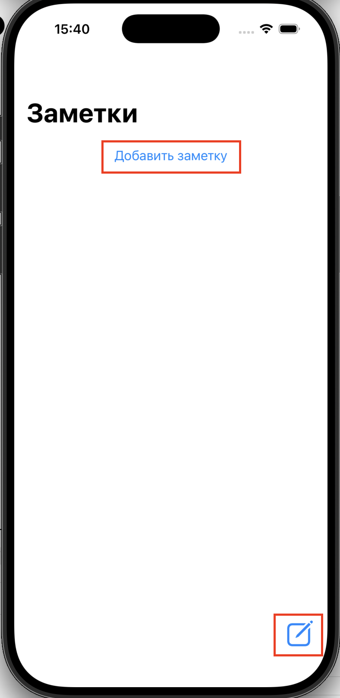
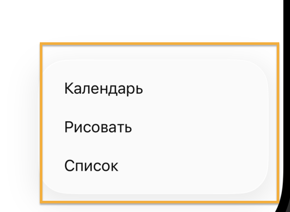
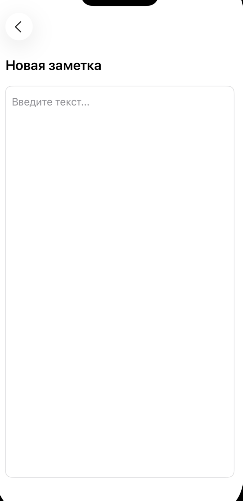
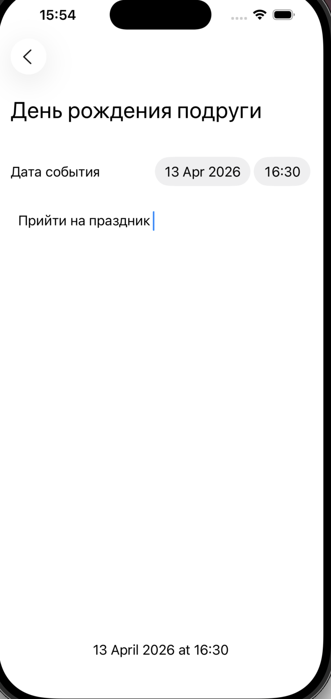
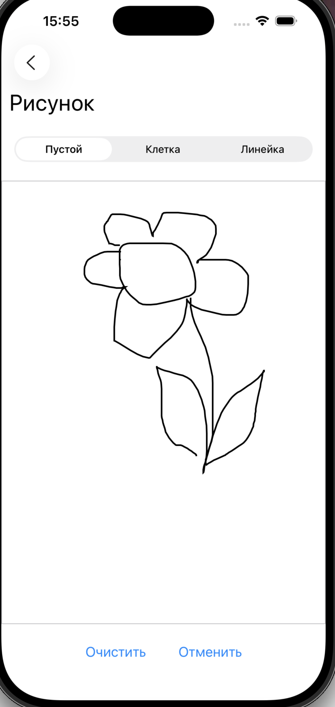
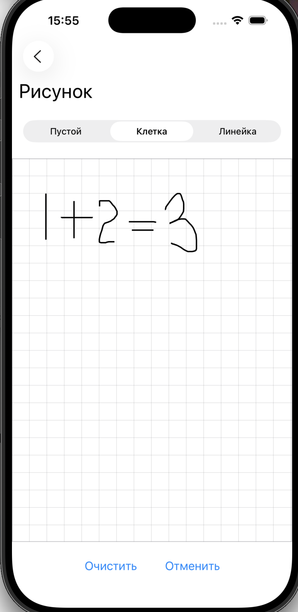
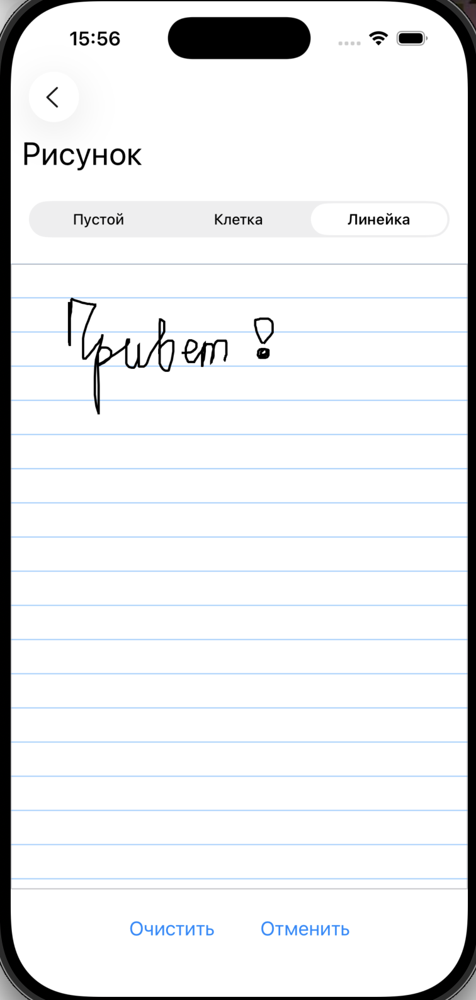
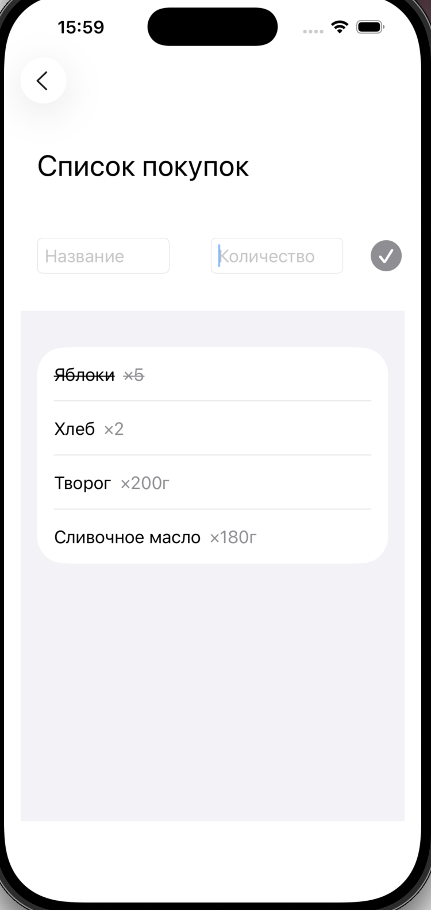
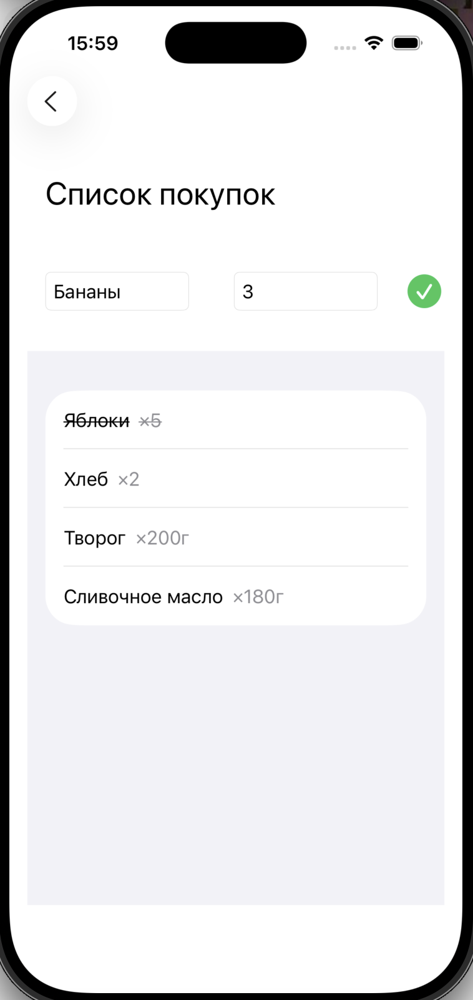
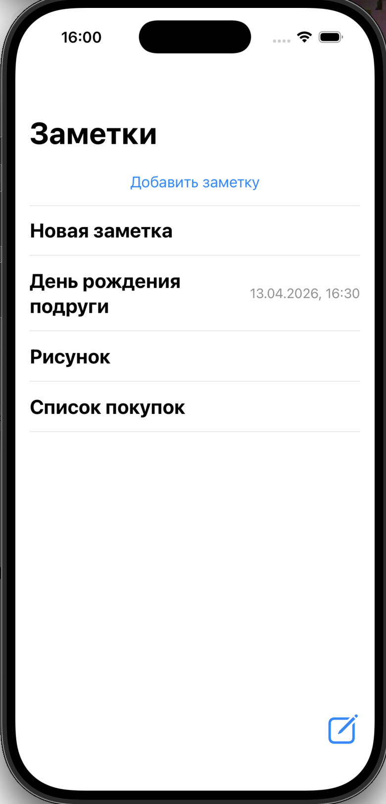

## Приложение заметок

### Описание
Приложение для создания заметок с поддержкой:
- текстовых заметок
- списков покупок
- календаря
- рисования

### Главный экран приложения  

На главном экране можно создать новую заметку или выбрать её тип.

---

### Обычная заметка  

Позволяет создавать и редактировать текстовые заметки.

---

### Календарь

Здесь можно:
- задать название события  
- выбрать дату и время  
- добавить описание  

---

### Рисование  

Можно выбрать один из трёх типов холста:

1. Обычный лист  

2. В клетку  

3. В линию  

Также доступны кнопки:
- Отменить — удаляет последнее действие  
- Очистить — полностью очищает холст  

---

### Список покупок  

Позволяет добавлять товары с указанием количества. 

- При нажатии на товар он отмечается как купленный (зачёркивается)  
- Если поля пустые — кнопка добавления неактивна  
- Если заполнены — становится активной  

---

### Сохранение заметок  

Все созданные заметки сохраняются на главном экране.  
Сохранение происходит при нажатии кнопки «Назад» в левом верхнем углу.  

